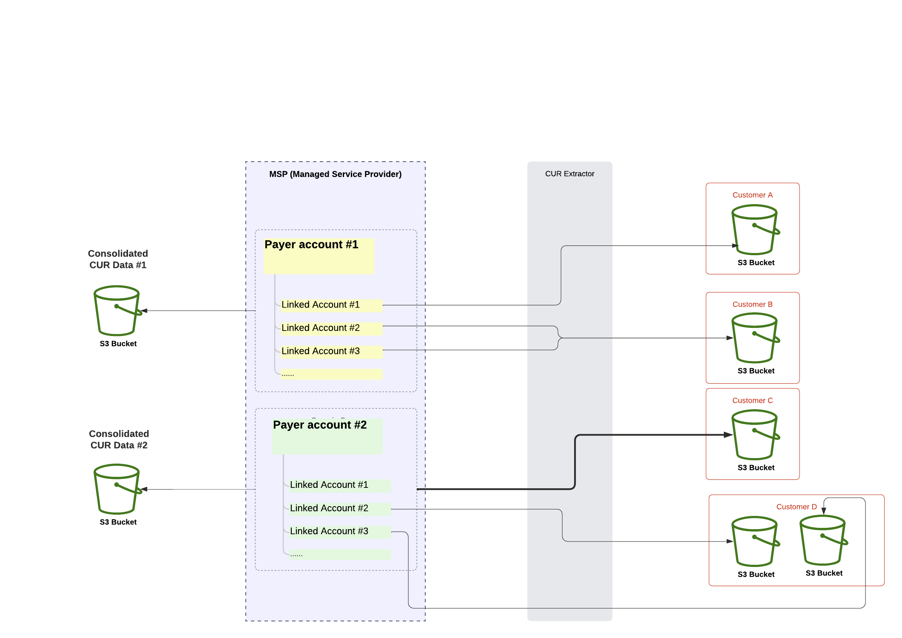

# CUR Extractor Application

This repository aims to help sanitize/split the Cost and Usage Reports (CUR) generated by AWS.
This CUR Extractor uses Django as its web framework, served by NGINX and uWSGI.

Example use case:



## Setting up the environment:

* Clone the repository

```
git clone git@github.com:grumatic/cur_extractor_admin.git
```

* Go to the cloned repository's directory

* Create your `.env` file
    (use the existing `.env-SAMPLE` file as template)
    * DJANGO_SUPERUSER_\* - is used for setting up the default django admin
    * SECRET_KEY - is used by Django for it crypto signing, should be random and unique
    * MONGO_NAME - the mongo container name used to connect django to the DB
    * CELERY_BROKER_URL - the redis url (using container name)

    * STS_ACCESS_KEY_ID - access key id from user with STS:AssumeRole permissions
    * STS_SECRET_ACCESS_KEY - secret access key from user with STS:AssumeRole permissions
    * EXTERNAL_ID - external_id from role creation (trusted entity)

* Change any desired Configs in `src/cur_extractor/Config/Config.py`
    * BEAT_\* - Used by celery to schedule task runs (default is at minue 00 every hour)
    * DOWNLOAD_PATH - will be the temporary path for the CUR data (deleted after every task if `NEED_REMOVE_TEMP` is `True`)
    * DEFAULT_PREFIX - default prefix added to the S3 object key
    * NEED_REMOVE_TEMP - whether the `DOWNLOAD_PATH` is supposed to be deleted after the task is ran
    * CHUNK_SIZE - the size of chunks analyzed. (bigger chunk sizes need more memory)

* Build through docker-compose

development using "runserver"
``` 
docker-compose up --build
```

production using uWSGI and NGINX
``` 
docker-compose -f docker-compose-prod.yaml up --build
```

The architecture used by the containers can be found bellow:


## Using the CUR Extractor


* After it's built, navigate to [http://localhost:8000](http://localhost:8000)

* Login with the admin username and password used in the `.env` file.

* You must create (in order):
    * Original CUR Info
        - The Original CUR Info ARN's role must have read permission of the bucket selected
        - The original CUR reports will be read from here
    * Payer Acccount
        - The Original CUR Info you select must be the one which has the account's CUR reports
    * Linked Account (optional)
        - Must be linked with one Payer Account.
        - This account can be use to filter the reports in the Output CUR Info
    * Output CUR Info
        - The Output CUR Info ARN's role must have write permission to the bucket entered
        - The report will be generated according to the Payer account selected.
        - The fields which have its cross box selected, will be included in the report.
        if you wish to remove them, you should unselect their respective cross box.
        - The accounts can be selected for more granular filtering. If no account is selected, all accounts included in the payer account's report will included in the report.


* CUR Updates:

A list of the last 100 updates can be seen in this page. A list of all the updates can also be downloaded here.
Note that the updates are stored per Original CUR (different date CUR will be treated as a separate report).


### Selectable fields

#### Altered columns
|UI Field|Affected CUR Columns|Action|
|--------|--------------------|------|
|Discount|`discount/RIVolumeDiscount` `discount/EDPDiscount` `discount/TotalDiscount` `discount/SPPDiscount`|Value of the column will be changed to 0 if it exists|
|Blended|`lineItem/BlendedRate` `lineItem/BlendedCost`|The blended value will be changed to match the corresponding unbleded value|
|Blended|`lineItem/NetBlendedRate` `lineItem/NetBlendedCost`|If the column exists, the value will be set to 0.|


#### Removed rows
|UI Field|Condition|
|--|------|
|Credit|`lineItem/LineItemType` column value == `Credit`|
|Refund|`lineItem/LineItemType` column value == `Tax`|
|Tax|`lineItem/LineItemType` column value == `Refund`|
|Discount|`lineItem/LineItemType` column value == `EDPDiscount` or `lineItem/LineItemType` == `RIVolumeDiscount`|


#### Required Role Permisions

The CUR Extractor requires read permissions to the bucket which contains the original reports; And write permisions to the bucket where the extracted data will be uploaded to.

**In the IAM Console**

1- Create a User with programmatic access with the following policy:

**Policy**

```
{
    "Version": "2012-10-17",
    "Statement": [
        {
            "Sid": "VisualEditor0",
            "Effect": "Allow",
            "Action": [
                "sts:AssumeRole",
                "sts:GetFederationToken"
            ],
            "Resource": "*"
        }
    ]
}
```

This user's access key id and secret access key should be used as the STS_ACCESS_KEY_ID and STS_SECRET_ACCESS_KEY environment variables respectively.


2- Create policy to allow verifying the bucket and retrieve/upload objects. 

**Sample read policy:**

```
{ 
    "Version": "2012-10-17", 
    "Statement": [ 
        { 
            "Effect": "Allow", 
            "Action": [ 
                "s3:ListBucket" 
            ], 
            "Resource": [ 
                "arn:aws:s3:::<bucket-name>" 
            ] 
        }, 
        { 
            "Effect": "Allow", 
            "Action": [ 
                "s3:GetObject" 
            ], 
            "Resource": [ 
                "arn:aws:s3:::<bucket-name>/*" 
            ] 
        } 
    ] 
} 
```


**Sample write policy:**
```
{
    "Version": "2012-10-17",
    "Statement": [
        {
            "Effect": "Allow",
            "Action": [
                "s3:ListBucket"
            ],
            "Resource": [
                "arn:aws:s3:::<bucket-name>"
            ]
        },
        {
            "Effect": "Allow",
            "Action": [
                "s3:PutObject"
            ],
            "Resource": [
                "arn:aws:s3:::<bucket-name>/*"
            ]
        }
    ]
}
```
 

3- Create a new Role: 

 

* **Trusted entity type:**  AWS Account 
* **Select “Another AWS Account”**
    * <Enter your account ID> 
* **Select “Require External ID”**
    * <Enter external ID (recommended)>
* **Next (Add permissions)**
    * <Select previously created policy> 
* **Next (Review)**
* <Enter a name for the Role> 
* <Enter description> (optional) 
* <Add Tags> (optional) 

**Review permissions**

**Create Role**

You can then use the Role's ARN in the CUR Extractor
